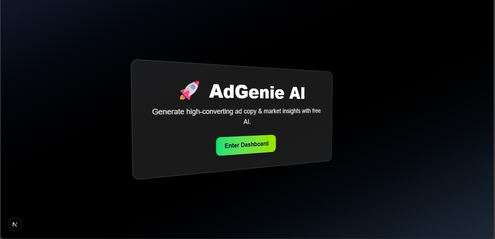

# 🚀 AdGenie AI – Phase 3 Completed

AdGenie AI is a free SaaS platform that empowers marketers and businesses to generate high-converting ad content and conduct market research using AI — powered entirely by free tools and APIs.

✅ This is **Phase 3** – Fully Functional Auth, DB, Dashboard, Deployment!

---

## 📸 Preview

>   
> _A futuristic 3D landing page powered by Tailwind CSS + Next.js_

---

## 🛠️ Built With

| Tech             | Description                                |
|------------------|--------------------------------------------|
| **Next.js 14**   | React framework with App Router            |
| **Tailwind CSS** | Utility-first modern CSS styling           |
| **TypeScript**   | Type-safe frontend & backend               |
| **NextAuth.js**  | Authentication with Google OAuth           |
| **MongoDB Atlas**| Cloud database for storing user ads        |
| **Prisma ORM**   | Connects Next.js to MongoDB                |
| **OpenRouter.ai**| Free AI API proxy (like OpenAI)            |
| **Vercel**       | CI/CD + Hosting                            |
| **Git & GitHub** | Source control + versioning                |

---
### Folder structure
adgenie-ai/
├── app/
│   ├── page.tsx              # Landing + input form
│   ├── dashboard/page.tsx    # Authenticated dashboard
│   ├── layout.tsx            # App-wide layout with auth wrapper
│   └── api/
│       └── generate/         # POST API: OpenRouter call
│       └── auth/[...nextauth]/ # Auth endpoints
├── components/
│   ├── AuthButtons.tsx       # Login / Logout button
│   └── SessionWrapper.tsx    # Wraps with SessionProvider
├── prisma/
│   └── schema.prisma         # MongoDB models
├── styles/
│   └── globals.css           # Tailwind base
├── public/
│   └── preview.png           # Preview image
├── .env.local                # Environment variables
├── tailwind.config.ts        # Tailwind theme config
├── tsconfig.json             # TypeScript config
└── README.md

---
## ✨ Phase 3 Features

- ✅ 3D landing page with product input
- ✅ Google login/logout using NextAuth.js
- ✅ Save generated ads to MongoDB per user
- ✅ Dashboard to view user-specific saved ads
- ✅ Auth-protected routes
- ✅ Responsive UI using Tailwind CSS

---

## 🧠 AI API Integration

This project uses **OpenRouter.ai API** to generate ad content like:

- 🎯 **Headline** (Catchy title)
- ✍️ **Caption** (1-line marketing copy)

### 📦 Prompt Example
```txt
Generate an ad in this format:
Headline: <your catchy title>
Caption: <short 1-line copy>

Product: GlowSkin Serum

git clone https://github.com/sagarsdevaraddi/adgenie-ai.git
cd adgenie-ai
npm install


